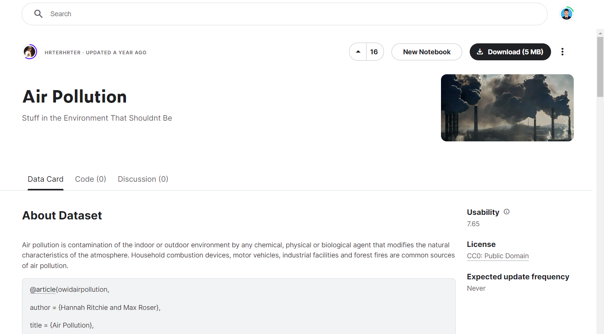

# project-big-data-2023
### Anggota Kelompok 5
- Achmad Wibawa (01)
- Komang Gede Narariya Suputra (10)
# Air Polution di Indonesia

# Membaca file CSV

# Filter data untuk daerah Indonesia

# Hapus kolom-kolom yang tidak dibutuhkan

# Mengubah nama kolom

# Mengurutkan data berdasarkan tahun secara ascending

# Megatur ulang indeks setelah diurutkan

# Menampilkan lima data pertama

# Hasil Akhir Diagram Batang

# Hasil Akhir Diagram LinierRegression

# Prediksi tahun 2022

